# DMS — Backend Increment 1
**Enterprise Computing | 4th Year ENSIA | Deadline: 27 February 2025**


## Architecture

| Service | Port | Technology | Role |
|---|---|---|---|
| documents-service | 8081 | Spring Boot + JPA + PostgreSQL | Add/list/download documents + S3 upload |
| comments-service | 8083 | Spring Boot + JPA + PostgreSQL | Add/list comments per document |
| esb-service | 8084 | Spring Integration | Orchestrate documents + comments |
| gateway-service | 8080 | Spring Cloud Gateway MVC | Single entry point, routes all requests |
| postgres | 5432 | PostgreSQL 15 | Persistent relational storage |
| minio | 9000/9001 | MinIO | S3-compatible object storage for files |


## Project Structure

```
DMS_YourName/
├── README.md
├── screenshots/
├── documents-service/
├── comments-service/
├── esb-service/
├── gateway-service/
└── dms-compose/
    └── docker-stack.yml         ← swarm deployment
└── dms-docker/
    └── docker-compose.yml       ← local dev
```


## Prerequisites

- Docker Desktop (with Swarm enabled)
- Java 21
- Maven 3.8+


## Build All Services

Run inside **each** service folder:

```bash
cd documents-service  &&  mvn clean install -DskipTests  &&  docker build -t dms-documents .
cd comments-service   &&  mvn clean install -DskipTests  &&  docker build -t dms-comments .
cd esb-service        &&  mvn clean install -DskipTests  &&  docker build -t dms-esb .
cd gateway-service    &&  mvn clean install -DskipTests  &&  docker build -t dms-gateway .
```


## Run with Docker Compose (local dev)

```bash
cd dms-compose
docker compose up -d
docker compose logs -f
docker compose down
```


## Deploy with Docker Swarm (submission)

```bash
# Initialize swarm once
docker swarm init

# Deploy stack
cd dms-compose
docker stack deploy -c docker-stack.yml dms

# Verify all services are 1/1
docker stack services dms
```

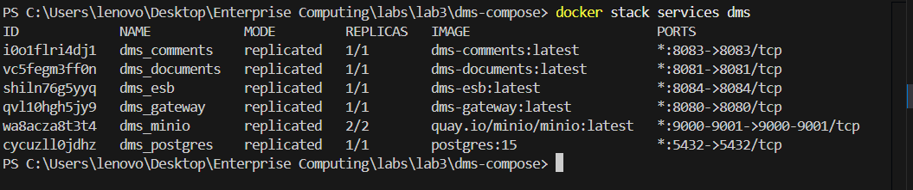


## First-Time Setup — Create MinIO Bucket

1. Open `http://localhost:9001`
2. Login: `admin` / `ensia123456`
3. Buckets → Create Bucket → name it `ensia`

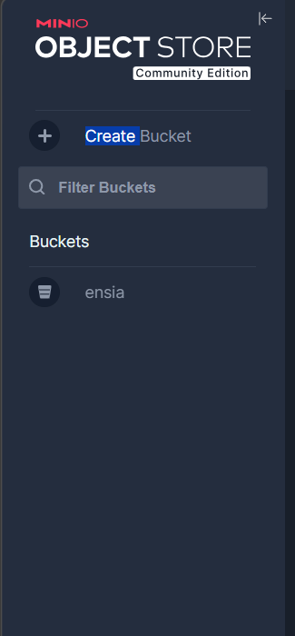


## API Demo — Screenshots

### Documents Service (port 8081)

**GET /documents/list — empty on first run**
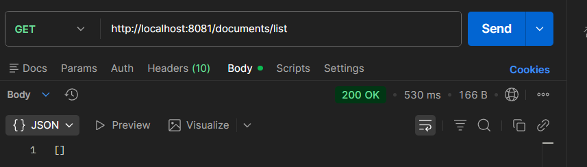

**POST /documents/add — form-data: title + file**
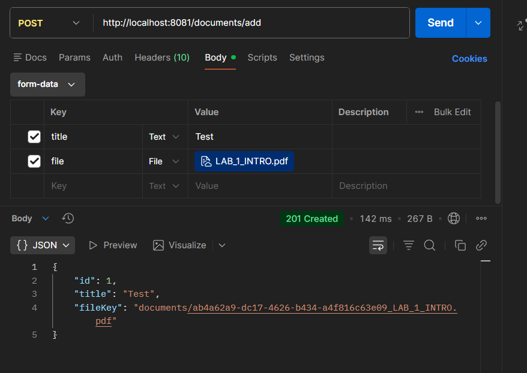

**GET /documents/get/1 — fetch by id**
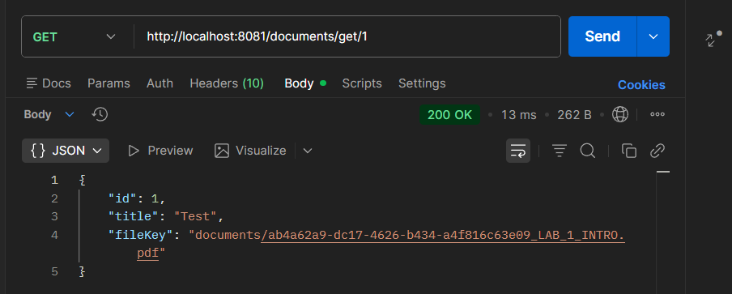

**GET /documents/1/file — download file from MinIO**
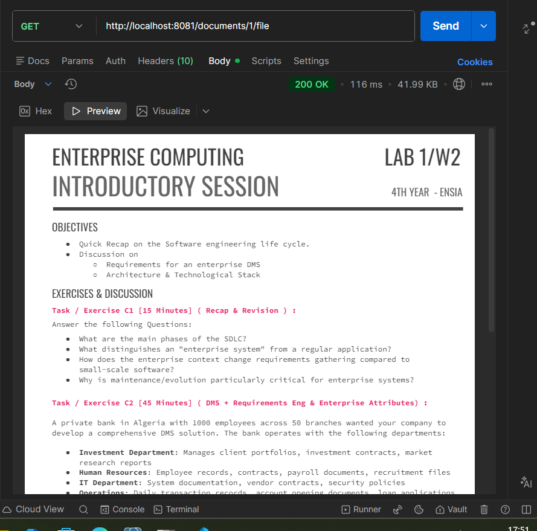

**GET /actuator/health**
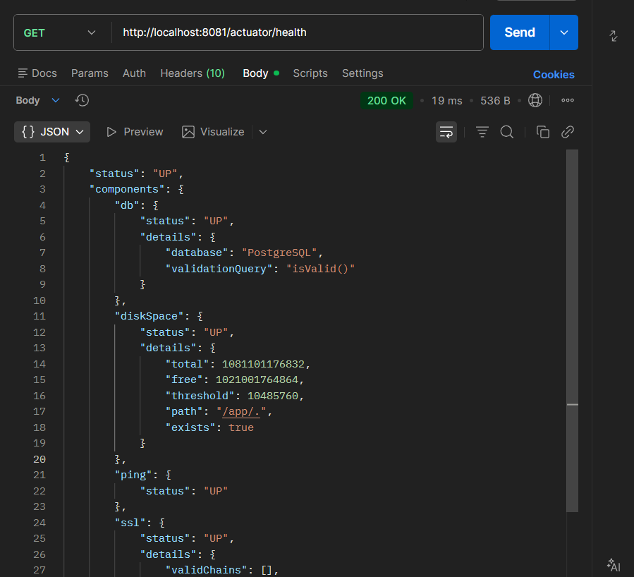


### Comments Service (port 8083)

**POST /comments/add**
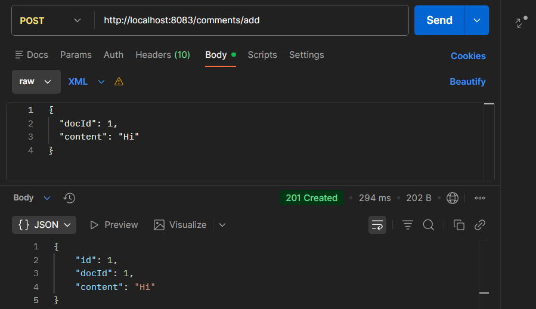

**GET /comments/list/1**
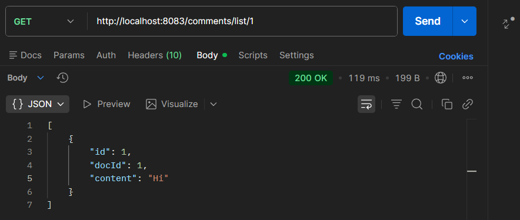

**GET /actuator/health**
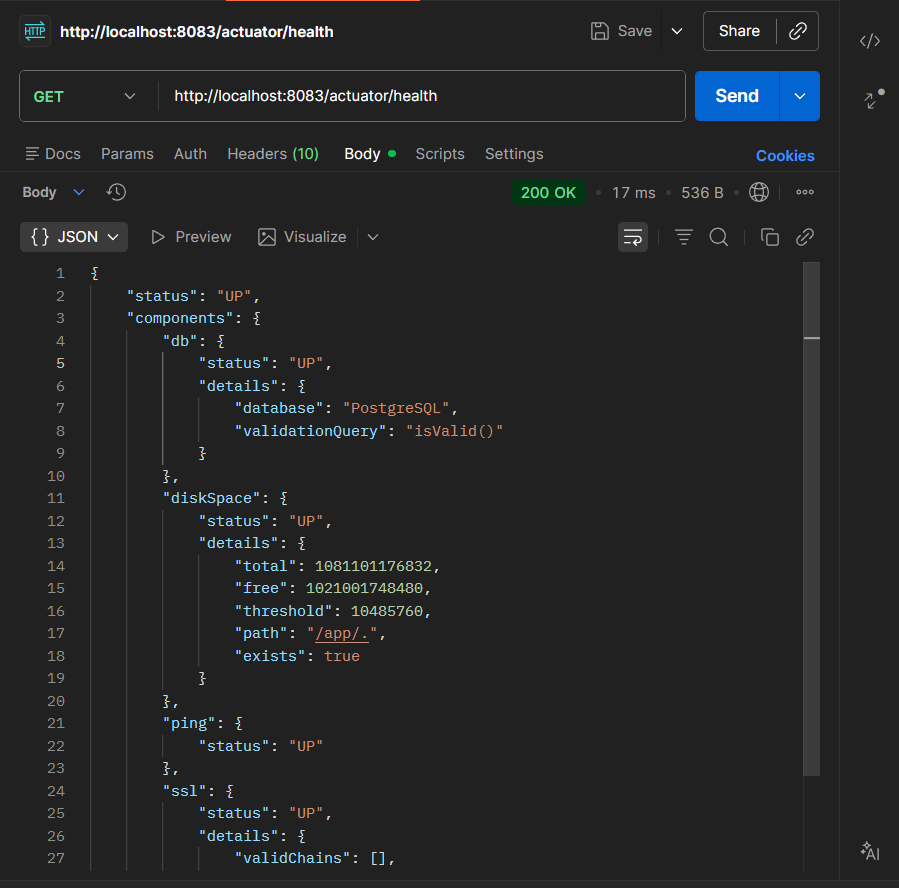


### ESB / Orchestration (port 8084)

**GET /document/1 — aggregated document + comments**
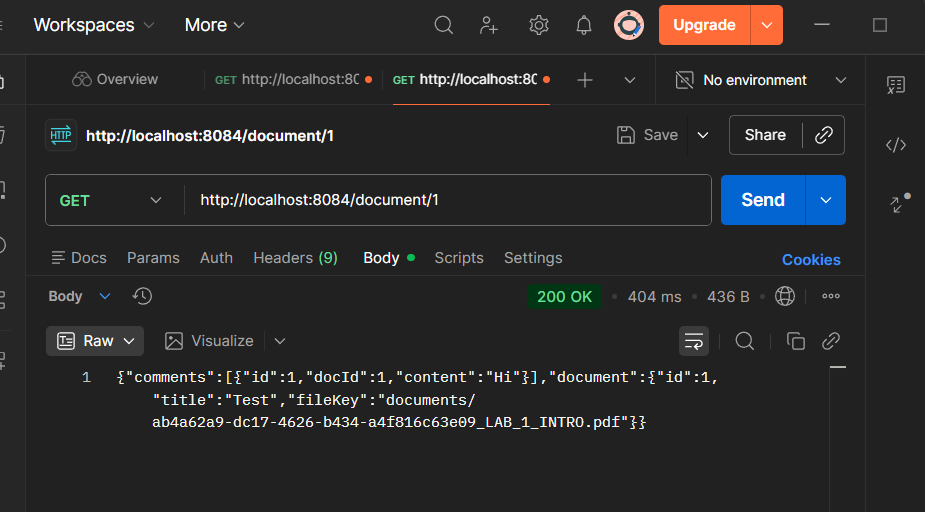

**GET /actuator/health**
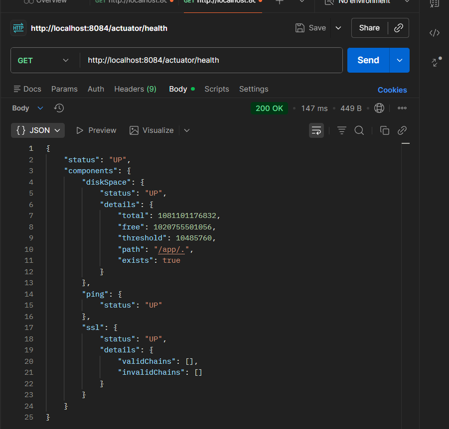


### Gateway (port 8080)

**GET /api/documents/list — routed to documents service**
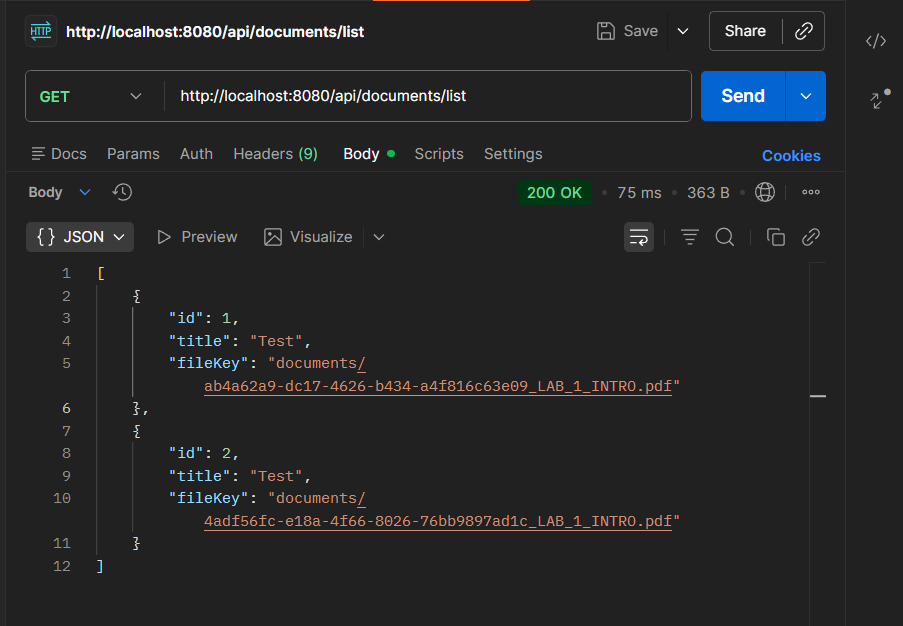

**GET /api/comments/list/1 — routed to comments service**
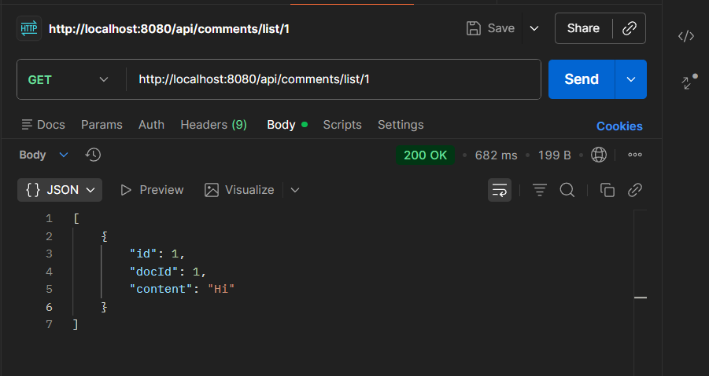

**GET /actuator/health**
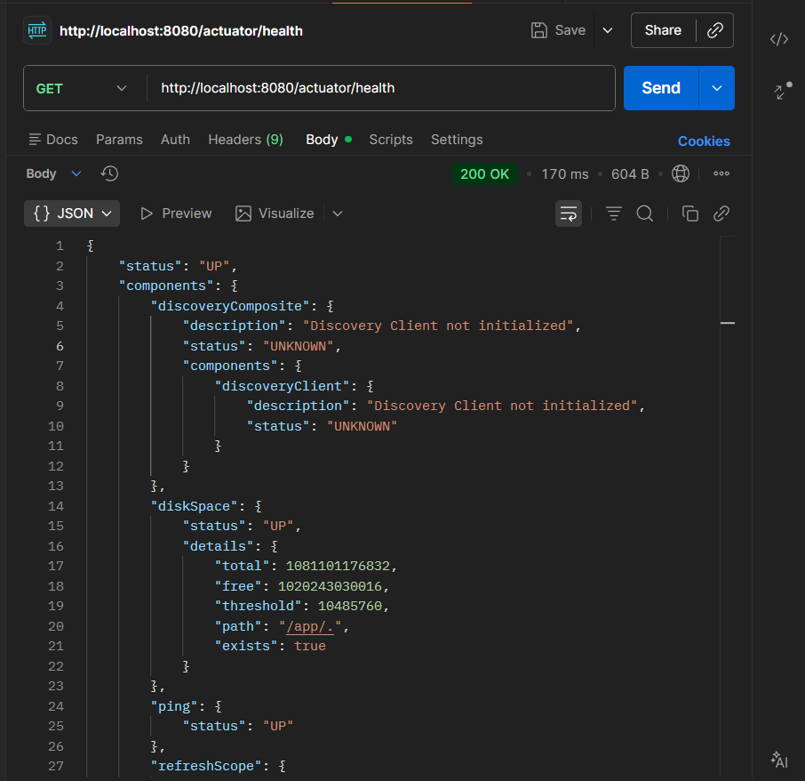


## Environment Variables

| Variable | Default | Used by |
|---|---|---|
| DB_URL | jdbc:postgresql://localhost:5432/dmsdb | documents, comments |
| DB_USER | ____ | documents, comments |
| DB_PASS | ____ | documents, comments |
| S3_ENDPOINT | http://localhost:9000 | documents |
| S3_ACCESS_KEY | admin | documents |
| S3_SECRET_KEY | ensia123456 | documents |
| S3_BUCKET | ensia | documents |
| DOCUMENTS_SERVICE_URL | http://localhost:8081 | esb, gateway |
| COMMENTS_SERVICE_URL | http://localhost:8083 | esb, gateway |
